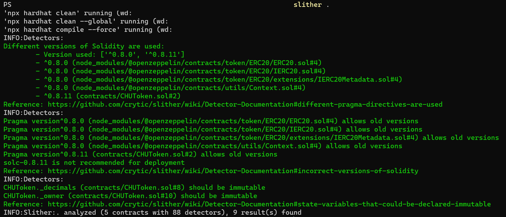

# CHU ERC-20 token

## Smart contract overview

CHU is a basic ERC-20 token that will be used to credit the currency after its release to Chainers internal wallet. 

This smart contract has some key additional features, these are:

- A pausing mechanism that allows all token transactions to be halted.

- A blacklist mechanism that allows certain addresses to be prohibited from transferring or receiving tokens.

- A customizable decimal setting (used on smart contract deployment only).

## Where to find

CHU is live on Polygon network, you can check it out [here](https://polygonscan.com/token/0x24878dfb65693f975d825e157a0685aec2300ad8).

## Security testing

Unit test cases can be found under `test` folder.



In order to get security tests audit, you can use `slither`. If python is installed on your computer, you can install `slither` via `pip3`:

```console
$ pip3 install slither-analyzer
```

Then run in project's folder:
```console
$ slither .
```


## State Variables

\_paused: A boolean variable that controls whether the contract is paused or not.

\_decimals: An 8-bit unsigned integer variable storing the number of decimals the token uses.

\_owner: The address that has special permission to mint/burn tokens, add/remove addresses from the blacklist, and pause/unpause the contract.

blacklisted: A mapping storing addresses that are prohibited from participating in token transfers.

## Modifiers

whenActive: Checks if the contract is not paused.

onlyOwner: Checks if the function caller is the owner of the contract.

checkBlacklist: Checks if an account is not blacklisted.

## Functions

### Constructor Function

constructor(uint8 \_setupDecimals): Initialises the contract. Sets the token name and symbol to "CHU", the contract owner to the contract creator (i.e., msg.sender), and the number of token decimals to \_setupDecimals (configured in config/default.js).

### Owner Functions

mint(uint256 amount): Mints amount tokens to the contract owner. Can only be called by the owner.

burn(uint256 amount): Burns amount tokens from the contract owner's balance. Can only be called by the owner.

addToBlacklist(address account): Adds account to the blacklist. The owner can't blacklist themselves. Can only be called by the owner.

removeFromBlacklist(address account): Removes account from the blacklist. Can only be called by the owner.

pause(): Pauses all token transfers. Can only be called by the owner.

unpause(): Unpauses the contract, resuming token transfers. Can only be called by the owner.

### Public Functions

decimals(): Returns the number of decimals the token uses.

approve(address spender, uint256 amount): Overrides the standard approve function to prevent blacklisted accounts from approving token transfers, and to prevent operation when the contract is paused.

isPaused(): Returns whether the contract is paused.

### Internal Functions

\_approve(address owner, address spender, uint256 amount): Overrides the standard \_approve function to prevent blacklisted accounts from approving token transfers, and to prevent operation when the contract is paused.

\_beforeTokenTransfer(address from, address to, uint256 amount): Overrides the standard \_beforeTokenTransfer function to prevent blacklisted accounts from participating in token transfers, and to prevent operation when the contract is paused.
